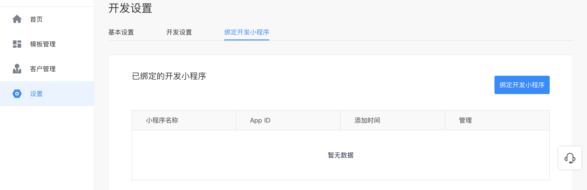
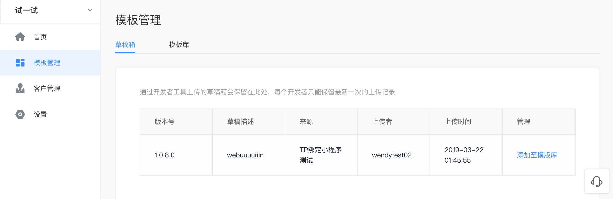

第三方平台为已授权的小程序提交代码时有两种方式：

1. 模板开发。先开发小程序模板，再用模板给授权小程序上传代码。
2. 定制开发。使用开发者工具直接为授权的小程序提交源代码。

具体流程如下：
## 一、模板开发

### 第一步：绑定开发小程序
1. 第三方平台的开发人员需先到智能小程序开发者平台（smartprogram.baidu.com）创建一个小程序。
2. 在第三方平台-设置-绑定开发小程序页面中，使用该小程序管理员账号登录百度APP并扫描二维码，将该小程序绑定为模板开发小程序。

### 第二步：开发并上传小程序模板草稿

1. 使用绑定开发小程序的管理员或成员账号登录百度小程序开发者工具（IDE）。
2. 开发者工具中按照正常的小程序开发流程进行代码开发和调试。
3. 开发完成后，点击发布，完成草稿上传。

**注意：上传草稿时，小程序根目录下请不要包含ext.json文件，否则无法上传成功**

### 第三步：添加小程序草稿至模板库，获取模板ID
从开发者工具中上传的代码，会先存在草稿箱中，开发者可在第三方平台操作或调用接口将草稿箱中的草稿添加到小程序模板库中，小程序模板库中的模板不会被覆盖。每个第三方平台最多可以有五十个代码模板，添加后可以获得模板ID。

### 第四步：开发者将小程序授权第三方平台
开发者需要通过百度APP扫描第三方平台提供的授权二维码，将小程序授权给第三方平台。具体第三方授权流程可参考文档：https://smartprogram.baidu.com/docs/develop/third/pro/

### 第五步：调用接口为授权小程序提交代码包
具体接口详见“小程序包管理”中相关接口：https://smartprogram.baidu.com/docs/develop/third/apppage/

## 二、定制开发

### 第一步：开发者将小程序授权第三方平台
开发者需要通过百度APP扫描第三方平台提供的授权二维码，将小程序授权给第三方平台。具体第三方授权流程可参考文档：https://smartprogram.baidu.com/docs/develop/third/pro/

### 第二步：开发并上传小程序源代码包
使用绑定开发小程序的开发者账号登录百度小程序开发者工具（IDE），并在开发者工具中按照正常的小程序开发流程进行代码开发和调试。开发完成后，在小程序包中增加ext.json文件，并在文件中增加extAppid字段（该appId请填写待提包的客户授权小程序id），点击发布即可完成授权小程序代码包提交。

> 您可通过开发者工具的命令行操作功能实现自动化操作，具体文档可参考：https://smartprogram.baidu.com/docs/develop/devtools/commandtool/ 。
