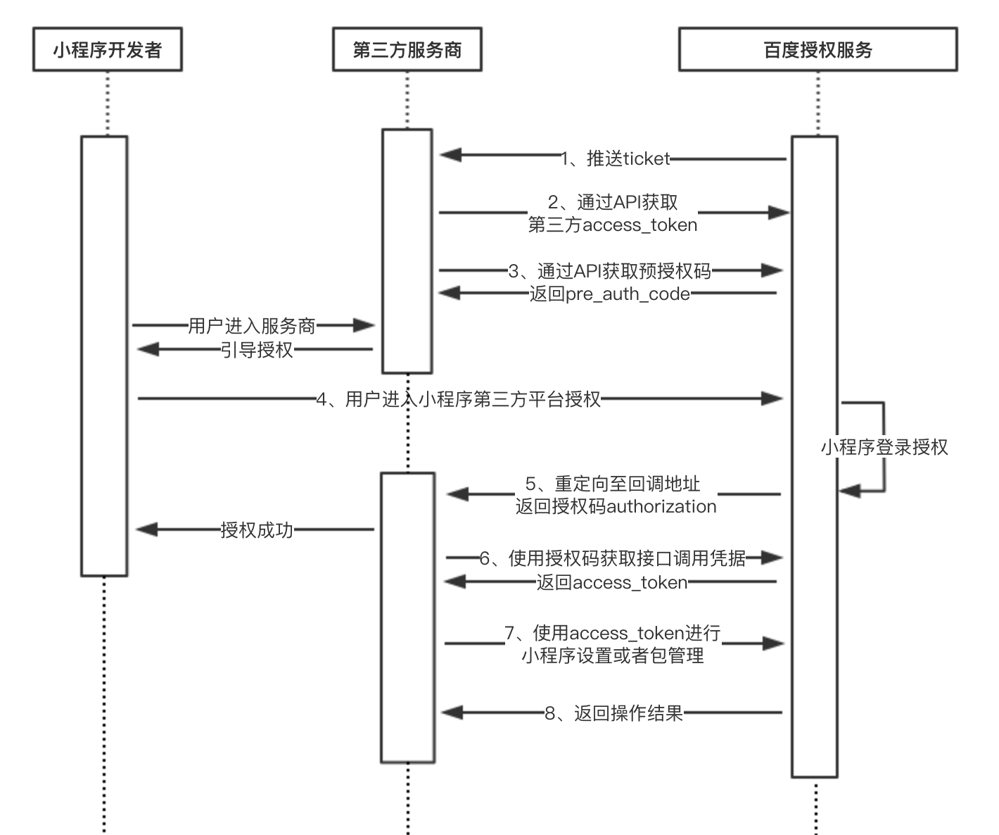

第三方平台（TP）是指帮助小程序运营者进行开发、管理、运营小程序并从此获取收益的平台；可在<a href="https://smartprogram.baidu.com/mappconsole/main/login ">小程序首页</a>进行注册，成为**企业类型**的智能小程序后即可创建第三方平台。**小程序运营者，可以一键授权给第三方平台，通过第三方平台来完成业务。**
<!-- 目前智能小程序第三方平台为邀请制，如需申请，请发邮件至：smartprogram_bd@baidu.com -->
<p>小程序授权给第三方平台的技术实现流程如下图：



## 授权流程详解

下面对各API和机制进行介绍（特别注意，所有API调用需要验证调用者IP地址。只有在第三方平台申请时填写的白名单IP地址列表内的IP地址，才能合法调用，其他一律拒绝）：

|顺序|功能	|API的作用|
|---|---|---|
|1|推送 ticket|	出于安全考虑，在第三方平台创建审核通过后，小程序TP平台服务器每隔10分钟会向第三方的消息接收地址推送一次 ticket，用于获取第三方平台接口调用凭据,接收到后必须直接返回字符串 success。|
|2|获取第三方平台 access_token|	第三方平台通过自己的 client_id 和 ticket（每10分钟推送一次的安全 ticket ）来获取自己的接口调用凭据（access_token）|
|3|获取预授权码 pre_auth_code|	第三方平台通过自己的接口调用凭据（access_token）来获取用于授权流程准备的预授权码（pre_auth_code）。|
|4|引导小程序管理员对第三方平台进行授权|	根据 client_id, pre_auth_code, redirect_uri生成授权二维码。|
|5|获取授权码 authorization_code	|引导小程序管理员扫码授权，在回调 URL 参数中返回授权码 (authorization_code) 和过期时间。|
|6|使用授权码换小程序的接口调用凭据和授权信息|	通过授权码和自己的接口调用凭据（access_token），换取小程序的接口调用凭据（access_token和用于前者快过期时用来刷新它的 refresh_token）和授权信息（授权了哪些权限等信息）。|
|7|获取（刷新）授权小程序的接口调用凭据|	通过自己的接口调用凭证 access_token 和 refresh_token 来刷新小程序的接口调用凭据。|
|8|获取小程序基础信息|	当小程序对第三方进行授权、取消授权、更新授权时，将通过事件推送告诉开发者。|

### 1、 推送ticket协议

在第三方平台创建审核通过后，小程序TP平台服务器会向其“授权事件接收URL”每隔10分钟定时推送 ticket ,用于获取第三方平台调用凭据，接收到后必须直接返回字符串 success。

post 数据示例：
```json
{
  "Nonce": "4464221",
  "TimeStamp": "1535551395",
  "Encrypt": "/X6AhuNc6ObfSXaA0/DI2SH4m4NAhaaLrYDxyeARIXnGkVYwjhSz/cK8ZLvPcbsHi6d8spK+brQwHw5+t55o4NuZj09x1TT2G6hkCQwU/R9ejDIv9yFI292XwkTMVkQ6dnZIwpvRbPmsV2EX6cagRl3C5KVlFme+6b4SS3aDat7dmpNyxjb6MdYCdZnzp4CmgbramsS0BtA/tnNgqKZ1VA==",
  "MsgSignature": "ba394c04acece6c2c0edee058c5dddf82474b8ee"
}
```
其中 Encrypt 参数需要解密，解密详情见<a href="https://smartprogram.baidu
.com/docs/third/deciphering/">智能小程序第三方平台加密解密技术方案</a>部分，解密后数据如下：
```json
{
    "Ticket" : "8c0da4968b0d1e28acbc1d738a56607d",
    "FromUserName" : "SmartAPP",
    "CreateTime" : 1413192605,
    "MsgType" : "ticket",
    "Event" : "push"
}
```
参数说明

|参数名	|描述|
|---|---|
|Ticket|	ticket内容|
|FromUserName|	固定为SmartApp|
|CreateTime|	时间戳|
|MsgType|	固定为ticket|
|Event|	固定为push|
### 2、 获取第三方平台access_token

第三方平台 access_token 是第三方平台的接口调用凭据，也叫做令牌（access_token）。每个令牌是有效期一个月，且令牌的调用次数有限，请第三方平台做好令牌的管理，在令牌过期之前进行刷新。

接口调用请求说明：
```
GET https://openapi.baidu.com/public/2.0/smartapp/auth/tp/token?client_id=OdxUiUVpVxH2Ai7G02cIjXGnnnMEUntD&ticket=8e329bc7e5fc432740d2e7e76a39c0e3
```
参数说明

|参数名	|类型|	是否必须|	描述|
|---|---|---|
|client_id|	string|	是|	第三方平台Key	 |
|ticket	|string	|是|	第三方平台服务器推送的 ticket，此 ticket 会定时推送，具体请见“1、 推送ticket协议”。|
返回值说明

|字段名|	类型|	描述|
|---|---|---|
|access_token|	string|	第三方平台access_token|
|expires_in	|int|	凭证有效时间，单位：秒|
|scope|	string|	拥有的权限说明|
错误情况下:

|字段名|	类型|	描述|
|---|---|---|
|errno|	int|	错误码；关于错误码的详细信息请参考 https://developer.baidu.com/wiki/index.php?title=docs/oauth/error 。|
|msg|	string|	错误描述信息，用来帮助理解和解决发生的错误。|
返回值示例
```json
{
    "errno":0,
    "msg":"success",
    "data" :{
        "access_token": "42.12835b16c449ae00f7d9a61570516b4f.2592000.1535536744.aPk4Eh420Yt-2JdTBB_F-34gJWz93WxN4e9rQhN",
        "expires_in": 2592000,
        "scope": "smartapp_tp_smtapp_common public"
    }
}
```
### 3、获取预授权码pre_auth_code

用于获取预授权码，预授权码用于小程序授权时的第三方平台方安全验证。

接口调用请求说明
```
GET https://openapi.baidu.com/rest/2.0/smartapp/tp/createpreauthcode?access_token=42.89210dcaa616b575cdca56f978cefbc2.2592000.1535617875.Wf0l2sXgdy5SabS_wP00-34gJWz93WxN4e9rQhN
```
参数说明

|参数名	|类型	|是否必须|	描述|
|---|---|---|---|
|access_token|	string|	是|第三方平台access_token，可参考"2、 获取第三方平台access_token"|
返回值说明

|字段名|	类型|	描述|
|---|---|---|
|pre_auth_code|	string|	预授权码|
|expires_in	|int|	凭证有效时间，单位：秒，默认20分钟|
返回值示例
```json
{
    "errno": 0,
    "msg": "success",
    "data": {
        "pre_auth_code": "c210YXBwMjAzMTQxODMzMThiMDlhMzhlZmEzMGM2MjAzY2NjMGQ5MTBlNGNmZWI1",
        "expires_in": 1200
    }
}
```
错误情况下:

|字段名|	类型|	描述|
|---|---|---|
|error	|string	|错误码；关于错误码的详细信息请参考 https://developer.baidu.com/wiki/index.php?title=docs/oauth/error 。|
|error_description|	string|	错误描述信息，用来帮助理解和解决发生的错误。|
### 4、引导小程序管理员对第三方平台进行授权

将用户浏览器从第三方平台授权发起页地址跳转到的如下授权页面，生成授权二维码。
> 注意：在授权前需要在第三方平台-设置-修改授权发起页域名处设置域名，否则提示发起页域名错误

页面地址:
```
https://smartprogram.baidu.com/mappconsole/tp/authorization?client_id=OdxUiUVpVxH2Ai7G02cIjXGnnnMEUntD&redirect_uri=https://xxx.baidu.com/mappconsole/main/apps&pre_auth_code=c210YXBwMTk4NjM0Mjg1NGFhMTRiMDMyNWQyMGE3ZGE0OWQ1ODE0OWQ1OGM0YzY4
```
参数说明

|参数名称|	类型|	是否必须|	描述|
|---|---|---|---|
|client_id|	string|	是|	第三方平台Key	 |
|pre_auth_code	|string	|是	|预授权码|
|redirect_uri|	string|	是	|回调URI|
### 5、授权回调，获取授权码 authorization_code

授权流程完成后，授权页会自动跳转进入回调地址，并在 URL 参数中返回授权码和过期时间`(redirect_url?authorization_code=xxx&expires_in=3600)`

### 6、使用授权码换小程序的接口调用凭据和授权信息
使用授权码换取小程序的授权信息，并换取 access_token和refresh_token。 授权码的获取，需要在用户在第三方平台授权页中完成授权流程后，在回调 URI 中通过 URL 参数提供给第三方平台方。
**说明**：
小程序可以自定义选择部分权限授权给第三方平台，因此第三方平台开发者需要通过步骤"8、获取小程序基础信息接口"来判断来获取小程序具体授权了哪些权限，而不是简单地认为自己声明的权限就是小程序授权的权限。

接口调用请求说明
```
GET https://openapi.baidu.com/rest/2.0/oauth/token?access_token=ACCESS_TOKEN&code=AUTH_CODE&grant_type=app_to_tp_authorization_code
```
参数说明

|参数名|	类型|	是否必须|	描述|
|---|---|---|---|
|access_token|	string|	是|	第三方平台access_token|
|code|	string|	是	|授权码|
|grant_type|	string	|是|	固定字符串：app_to_tp_authorization_code|
返回值说明

|字段名|	类型|	描述|
|---|---|---|
|access_token|	string|	授权小程序的接口调用凭据|
|refresh_token|	string|	接口调用凭据刷新令牌，有效期10年，使用一次后失效|
|expires_in|	int|	Access Token的有效期，单位：秒，默认1小时|
返回值示例
```json
{
    "access_token": "45.1d4146fdea08ab043a2d291b0e2d86ca.3600.1536147748.C1Q38_EEfQjeNhZ1diO5d7hX8Dx_-mVMFst84kTtF6Sn4je",
    "refresh_token": "46.4d79bd6882af6d2bb238b2f851f3a00f.315360000.1851504148.C1Q38_EEfQjeNhZ1diO5d7hX8Dx_-mVMFst84kTtF6Sn4je",
    "expires_in": 3600
}
```
错误情况下:

|字段名|	类型|	描述|
|---|---|---|
|error|	string|	错误码；关于错误码的详细信息请参考 https://developer.baidu.com/wiki/index.php?title=docs/oauth/error|
|error_description|	string|	错误描述信息，用来帮助理解和解决发生的错误|
### 7、刷新授权小程序的接口调用凭据
当在授权小程序的接口调用凭据（access_token）失效时，可用刷新令牌（refresh_token）获取新的令牌。当换取refresh_token后建议保存。

接口调用请求说明
```
GET https://openapi.baidu.com/rest/2.0/oauth/token?access_token=ACCESS_TOKEN&refresh_token=REFRESH_TOKEN&grant_type=app_to_tp_refresh_token
```
参数说明

|参数名	|类型	|是否必须|	描述|
|---|---|---|---|
|access_token	|string	|是	|第三方平台access_token|
|refresh_token|	string|	是|	接口调用凭据刷新令牌，有效期10年，使用后失效|
|grant_type	|string|	是	|固定字符串： app_to_tp_refresh_token|
返回值说明

|字段名|	类型|	描述|
|---|---|---|
|access_token|	string|	授权小程序的接口调用凭据|
|refresh_token|	string	|接口调用凭据刷新令牌|
|expires_in	|int|	小程序的Access Token的有效期，单位：秒，默认1小时|
返回值示例
```json
{
    "access_token": "45.c1cb2c4ddd225536ca80d70875a9f60d.3600.1536148028.FiKQ1VSLjMjS7uaJZlCdbOcjcasQ-mVMFst84kTtF6Sn4je",
    "refresh_token": "46.045cabb3f09efe6c8fa570de94a41773.315360000.1851504428.FiKQ1VSLjMjS7uaJZlCdbOcjcasQ-mVMFst84kTtF6Sn4je",
    "expires_in": 3600
}
```
错误情况下:

|字段名	|类型	|描述|
|---|---|---|
|error	|string|	错误码；关于错误码的详细信息请参考 https://developer.baidu.com/wiki/index.php?title=docs/oauth/error|
|error_description|	string|	错误描述信息，用来帮助理解和解决发生的错误|

### 8、获取小程序基础信息

```
GET https://openapi.baidu.com/rest/2.0/smartapp/app/info?access_token=ACCESS_TOKEN
```

**公共请求参数** 

| 参数         | 类型   | 是否必填 | 描述                     | 示例值 |
| ------------ | ------ | -------- | ------------------------ | ------ |
| access_token | string | 是       | 授权小程序的接口调用凭据 | --     |

**请求参数** 

| 参数 | 类型 | 是否必填 | 描述 | 示例值 |
| ---- | ---- | -------- | ---- | ------ |
|      |      |          |      |        |

**公共响应参数** 

| 参数  | 类型    | 描述     | 示例值   |
| ----- | ------- | -------- | -------- |
| errno | integer | 状态码   | 40001    |
| msg   | string  | 状态描述 | 参数错误 |
| data  | object  | 响应参数 | --       |

**响应参数** 

| 参数名                                 | 类型   | 描述                                                         |
| -------------------------------------- | ------ | ------------------------------------------------------------ |
| app\_id                                | int    | 小程序的appid                                                |
| app\_name                              | string | 小程序的名称                                                 |
| app_key                                | string | 小程序的key                                                  |
| app\_desc                              | string | 小程序的介绍内容                                             |
| photo\_addr                            | string | 小程序图标                                                   |
| qualification                          | object | 小程序账号对应的主体信息                                     |
| qualification.name                     | string | 主体名称                                                     |
| qualification.type                     | int    | 主体类型  <br>1：个人 <br>2：企业 <br>3： 政府 <br>4：媒体 <br> 5：其他 <br>个人暂不开放 |
| qualification.satus                    | int    | 主体审核状态 <br>1：通过 <br>2：审核中 <br>3：审核失败       |
| qualification.ad\_type                 | int    | 高级认证类型 <br>-1：其他类型验证<br>0：未做高级认证 <br>1：对公验证 <br>2：活体验证<br>23：法人人脸验证 |
| qualification.ad_status                | int    | 高级认证状态 <br>1：通过 <br>3：失败                         |
| category                               | array  | 小程序类目信息                                               |
| category.category\_id                  | int    | 类目id                                                       |
| category.category\_name                | string | 类目名称                                                     |
| category.reason                        | string | 审核失败原因                                                 |
| category.audit\_status                 | int    | 类目审核状态 <br>1：审核中 <br>2：审核成功 <br>3：审核失败   |
| category.parent                        | object | 父类目                                                       |
| category.category\_id                  | int    | 父类目id                                                     |
| category.category\_name                | int    | 父类目名称                                                   |
| category.category\_desc                | int    | 父类目描述                                                   |
| audit_info                             | object | 基本信息审核状态 包括名称，图标，介绍内容的审核状态 只有审核中和审核失败会展示 |
| audit\_info.audit\_app\_name\_status   | int    | 小程序名称审核状态 <br>1：审核中 <br>3：审核失败             |
| audit\_info.audit\_app\_name           | int    | 小程序名称审核值                                             |
| audit\_info.audit\_app\_name\_reason   | int    | 小程序名称审核失败原因                                       |
| audit\_info.audit\_app\_desc\_status   | int    | 小程序介绍内容审核状态                                       |
| audit\_info.audit\_app\_desc           | int    | 小程序介绍内容审核值                                         |
| audit\_info.audit\_app\_desc\_reason   | int    | 小程序介绍内容失败原因                                       |
| audit\_info.audit\_photo\_addr\_status | int    | 小程序头像审核状态                                           |
| audit\_info.audit\_photo\_addr         | int    | 小程序头像审核值                                             |
| audit\_info.audit\_photo\_addr\_reason | int    | 小程序头像审核失败原因                                       |
| modify\_count                          | object | 小程序基本信息修改次数信息                                   |
| modify\_count.name\_modify\_used       | int    | 小程序名称已修改次数                                         |
| modify\_count.name\_modify\_quota      | int    | 小程序名称总共的可修改次数                                   |
| modify\_count.signature\_modify\_used  | int    | 小程序简介已修改次数                                         |
| modify\_count.signature\_modify\_quota | int    | 小程序简介总共的可修改次数                                   |
| modify\_count.image\_modify\_used      | int    | 小程序头像已修改总次数                                       |
| modify\_count.image\_modify\_quota     | int    | 小程序头像总共的可修改次数                                   |
| modify\_count.category\_modify\_used   | int    | 小程序类目已修改次数                                         |
| modify\_count.category\_modify\_quota  | int    | 小程序类目总共的可修改次数                                   |
| auth_info                              | array  | 小程序权限集合信息                                           |
| auth_info.scope_name                   | string | 权限名称                                                     |
| auth_info.type                         | int    | 权限类型(0:小程序纬度权限 1:账号纬度权限)                    |
| annual\_review\_info									| object    |  小程序年审相关信息        |
| annual\_review\_info.annual_review_status | int | 年审状态  <br>1：正常 <br>2：待年审 <br>3： 年审过期 |
| annual\_review\_info.annual\_review\_overdue\_time| string | 年审过期时间 |
| app\_offline\_info                    | object|  小程序强制下线相关信息      |
| app\_offline\_info.offline\_reason      | int  |     强制下线类型<br> 1:基本信息强制下线 <br>2:小程序代码包强制下线     |
| app\_offline\_info.illegal\_fields            | string |   强制下线原因 <br> appName:名称 <br> photoAddr:图片 <br> 
appDesc:简介<br>当有多个时用逗号(,)连接, offlineReason为1或3时才有           |
| min\_swan\_version                     | string | 开发者工具最低版本                                           |
| min\_swan\_version                     | string | 开发者工具最低版本                                           |
| status                                 | int    | 小程序的状态 <br>-1：代表封禁 <br>1：代表正常 <br>2：代表审核中 <br>4：代表暂停服务<br>5：强制下线 |
| web\_status                            | int    | 小程序的web化开关状态 <br> 0:未开启 <br>1:开启 <br>2:关闭    |

**请求示例** 

```shell
curl -X GET \
  'https://openapi.baidu.com/rest/2.0/smartapp/app/info?access_token=45.8456925a1fa1ed237f64114d2bfa3890.3600.1559561689.Cckr3yEJVH4X5JJnZmgfNX4wo_ej3y4-1W3JTSQkkj5RZ9lgfC'
```


**响应示例** 

```json
{
    "errno":0,
    "msg":"success",
    "data":{
        "app_id":111111,
        "app_name":"小程序",
        "app_key":"1eQayZtM6Vg5C9E3vAgg2IOYjugXqNj2",
        "app_desc":"1531812276",
        "photo_addr": "[{\"cover\": \"https://b.bdstatic.com/searchbox/mappconsole/image/20180416/1523870283-34303.jpg\"}]",
        "qualification":{
            "name":"",
            "type":1,
            "satus":1,
            "ad_type":1,
            "ad_status":1
        },
        "modify_count":{
            "name_modify_used":4,
            "name_modify_quota":5,
            "signature_modify_used":0,
            "signature_modify_quota":5,
            "image_modify_used":0,
            "image_modify_quota":5,
            "category_modify_used":0,
            "category_modify_quota":3
        },
        "category":[
            {
                "category_id":1,
                "category_name":"电商",
                "category_desc":"电商",
                "reason":"失败原因",
                "audit_status":1,
                "parent":{
                    "category_id":2,
                    "category_name":"电商",
                    "category_desc":"电商"
                }
            }
        ],
        "audit_info":{
            "audit_app_name_status":1,
            "audit_app_name":"测试中名称",
            "audit_app_name_reason":"名称审核审核失败原因",
            "audit_app_desc_status":3,
            "audit_app_desc":"测试中描述",
            "audit_app_desc_reason":"审核审核失败原因",
            "audit_photo_addr_status":1,
            "audit_photo_addr":"xxx",
            "audit_photo_addr_reason":"头像审核失败原因"
        },
        "auth_info":[
            {
                "scope_name":"数据权限",
                "type":0
            },
            {
                "scope_name":"账号管理权限",
                "type":0
            },
            {
                "scope_name":"推广权限",
                "type":0
            }
        ],
        "annual_review_info": {
            "annual_review_status": 2,
            "annual_review_overdue_time": 1542688104
        },
        "app_offline_info": [
            {
                "offline_reason": 1,
                "illegal_fields": "appName"
            },
            {
                "offline_reason": 2
            }
        ],
        "min_swan_version":"1.6.17",
        "status":1,
        "web_status":1
    }
}
```


### 9、找回授权码
为了防止refresh_token丢失后失去小程序的操作权限，增加补偿机制，通过目前存在授权关系直接找回authorization\_code后，可以再换取小程序的接口调用凭据。

```
POST https://openapi.baidu.com/rest/2.0/smartapp/auth/retrieve/authorizationcode?access_token=ACCESS_TOKEN
```

##### 参数说明:
参数名 | 类型 | 是否必须 | 描述
----- |-----| ------| -----
access_token	|string |是 | 第三方平台access_token
app_id | int | 是 | 小程序app_id

##### 返回值说明:

| 参数名              | 类型   | 描述           |
| ------------------- | ------ | ------------ |
| authorization\_code | string | 授权码        |
| expires\_in         | int    | 授权码有效时间 |

##### 返回值示例:
```
{
    "errno": 0,
    "msg": "success",
    "data": {
        "authorization_code": "f5a09b58eb2dc01c728182d097808145",
        "expires_in": 18000
    }
}
```

##### 错误码表
错误码 | 错误描述 | 
----- |-----
50032| 没有授权关系，请检查

### 10、推送授权相关通知
当小程序对第三方平台进行授权、取消授权、更新授权后，百度服务器会向第三方平台方的授权事件接收URL（创建第三方平台时填写）推送相关通知。

POST数据示例（取消授权通知）

```
{
    "appId": 小程序appid,
    "tpAppId": 第三方平台appid,
    "eventTime": "2019-01-14 12:45:10",
    "event": "UNAUTHORIZED"
}
```

POST数据示例（授权成功通知）

```
{
    "appId": 小程序appid,
    "tpAppId": 第三方平台appid,
    "eventTime": "2019-01-14 12:45:10",
    "event": "AUTHORIZED",
    "authorizationCode":"授权码",
    "authorizationCodeExpiresIn":60
}
```

POST数据示例（授权更新通知）

```
{
    "appId": 小程序appid,
    "tpAppId": 第三方平台appid,
    "eventTime": "2019-01-14 12:45:10",
    "event": "UPDATE_AUTHORIZED",
    "authorizationCode":"授权码",
    "authorizationCodeExpiresIn":60
}
```

第三方平台方在收到授权相关通知后也需进行解密，接收到后之后只需直接返回字符串success。为了加强安全性，postdata中的数据将使用服务申请时的加解密key来进行加密，具体请见<a href="https://smartprogram.baidu.com/docs/third/deciphering/">智能小程序第三方平台加密解密技术方案</a>。


#### 参数说明

|参数名 | 类型 | 描述|
|----- |-----|  -----|
|appId |long | 小程序appid|
|tpAppId | long | 第三方平台id|
|eventTime |string | 事件发生时间|
|event |string | AUTHORIZED:新建授权关系<br> UNAUTHORIZED:解除授权关系<br> UPDATE_AUTHORIZED:授权关系更新|
|authorizationCode |string | 授权码可以换取小程序的接口调用凭据|
|authorizationCodeExpiresIn |int | 授权码过期时间（单位：秒）|

