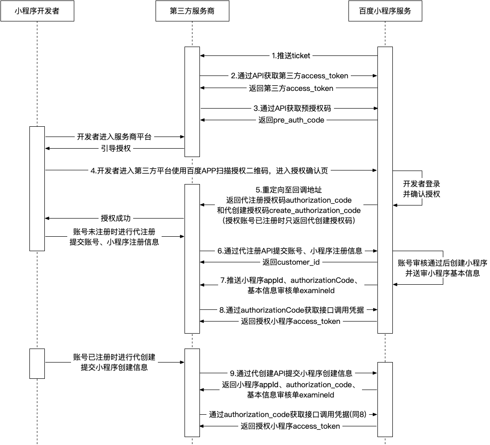

## 代注册账号、代创建小程序功能文档

**使用此功能前，请您发送邮件至 TP-smartprogramme@baidu.com 申请开通接口权限**

### 一、流程图


### 二、流程详解

基于上述流程图，下面将针对代注册、代创建流程中涉及到的各API和机制进行详细介绍
> 注意：所有API调用需要验证调用者IP地址。只有在第三方平台申请时填写的白名单IP地址列表内的IP地址，才能合法调用，其他一律拒绝

顺序 | 功能 | API的作用
----- |-----| ------
1 | 推送 ticket | 出于安全考虑，在第三方平台创建审核通过后，小程序TP平台服务器每隔10分钟会向第三方的消息接收地址推送一次 ticket，用于获取第三方平台接口调用凭据,接收到后必须直接返回字符串 success
2 | 获取第三方平台 access\_token | 第三方平台通过自己的 client\_id 和 ticket（每10分钟推送一次的安全 ticket ）来获取自己的接口调用凭据（access\_token）
3 | 获取预授权码 pre\_auth\_code | 第三方平台通过自己的接口调用凭据（access\_token）来获取用于授权流程准备的预授权码（pre\_auth\_code）
4 | 引导小程序管理员对第三方平台进行授权 | 根据 client\_id, pre\_auth\_code, redirect\_uri，type=1 生成授权二维码
5 | 获取代注册授权码 authorization\_code 和代创建授权码 create\_authorization\_code | 引导小程序管理员扫码授权，在回调 URL 参数中返回代注册授权码 (authorization\_code) 和代创建授权码 (create\_authorization\_code) 。**注意：代注册授权码及代创建授权码均无过期时间，在授权关系持续期间一直有效，请妥善保存**
6 | 通过代注册 API 注册账号并创建小程序 | 当第5步获取到代注册授权码 (authorization\_code) 时，表明该账号在授权时未完成账号注册，此时可通过代注册授权码调用代注册 API，提交账号主体资质及小程序基本信息以完成账号注册及小程序创建；此外，当账号审核失败时，也可重新调用该 API 提交修改后的资质信息
7 | 代注册结果推送 | 当小程序账号审核通过后，系统会自动为该账号创建一个小程序，将之前提交的小程序基本信息送审，并将小程序的 appid、授权码 authorizationCode、基本信息审核单 examineId 推送至授权事件接收 URL ；若账号审核未通过，则会推送审核失败原因
8 | 通过授权码获取小程序接口调用凭据 | 通过授权码（代注册成功推送的 authorizationCode 或 代创建成功返回的 authorization\_code）和第三方平台接口调用凭据（access\_token），换取授权小程序的接口调用凭据（access\_token 和用于前者快过期时用来刷新它的  refresh\_token）和授权信息（授权了哪些权限等信息）
9 | 通过代创建 API 创建小程序 | 当第5步仅获取到代创建授权码 (create\_authorization\_code)时，表明该账号在授权时已完成账号注册，此时可通过代创建授权码调用代创建 API，提交小程序基本信息以创建一个小程序 ，成功后可获得小程序授权码authorization\_code；此外，当需要为同一个账号创建多个小程序时，也可通过调用该 API 实现

### 1、推送 ticket 协议

在第三方平台创建审核通过后，小程序TP平台服务器会向其“授权事件接收URL”每隔10分钟定时推送 ticket ,用于获取第三方平台调用凭据，接收到后必须直接返回字符串 success。

post 数据示例：
```json
{
  "Nonce": "4464221",
  "TimeStamp": "1535551395",
  "Encrypt": "/X6AhuNc6ObfSXaA0/DI2SH4m4NAhaaLrYDxyeARIXnGkVYwjhSz/cK8ZLvPcbsHi6d8spK+brQwHw5+t55o4NuZj09x1TT2G6hkCQwU/R9ejDIv9yFI292XwkTMVkQ6dnZIwpvRbPmsV2EX6cagRl3C5KVlFme+6b4SS3aDat7dmpNyxjb6MdYCdZnzp4CmgbramsS0BtA/tnNgqKZ1VA==",
  "MsgSignature": "ba394c04acece6c2c0edee058c5dddf82474b8ee"
}
```
其中 Encrypt 参数需要解密，解密详情见<a href="https://smartprogram.baidu
.com/docs/develop/third/deciphering/">智能小程序第三方平台加密解密技术方案</a>部分，解密后数据如下：
```json
{
    "Ticket" : "8c0da4968b0d1e28acbc1d738a56607d",
    "FromUserName" : "SmartAPP",
    "CreateTime" : 1413192605,
    "MsgType" : "ticket",
    "Event" : "push"
}
```
参数说明

|参数名	|描述|
|---|---|
|Ticket|	ticket内容|
|FromUserName|	固定为SmartApp|
|CreateTime|	时间戳|
|MsgType|	固定为ticket|
|Event|	固定为push|


### 2、获取第三方平台 access\_token

第三方平台 access\_token 是第三方平台的接口调用凭据，也叫做令牌（access\_token）。每个令牌是有效期一个月，且令牌的调用次数有限，请第三方平台做好令牌的管理，在令牌过期之前进行刷新。

接口调用请求说明：
```
GET https://openapi.baidu.com/public/2.0/smartapp/auth/tp/token?client_id=OdxUiUVpVxH2Ai7G02cIjXGnnnMEUntD&ticket=8e329bc7e5fc432740d2e7e76a39c0e3
```
参数说明

|参数名	|类型|	是否必须|	描述|
|---|---|---|
|client\_id|	string|	是|	第三方平台Key	 |
|ticket	|string	|是|	第三方平台服务器推送的 ticket，此 ticket 会定时推送，具体请见“1、 推送ticket协议”。|
返回值说明

|字段名|	类型|	描述|
|---|---|---|
|access\_token|	string|	第三方平台access\_token|
|expires\_in	|int|	凭证有效时间，单位：秒|
|scope|	string|	拥有的权限说明|
错误情况下:

|字段名|	类型|	描述|
|---|---|---|
|errno|	int|	错误码；关于错误码的详细信息请参考 http://developer.baidu.com/wiki/index.php?title=docs/oauth/error 。|
|msg|	string|	错误描述信息，用来帮助理解和解决发生的错误。|
返回值示例
```json
{
    "errno":0,
    "msg":"success",
    "data" :{
        "access_token": "42.12835b16c449ae00f7d9a61570516b4f.2592000.1535536744.aPk4Eh420Yt-2JdTBB_F-34gJWz93WxN4e9rQhN",
        "expires_in": 2592000,
        "scope": "smartapp_tp_smtapp_common public"
    }
}
```


### 3、获取预授权码 pre\_auth\_code

用于获取预授权码，预授权码用于小程序授权时的第三方平台方安全验证。

接口调用请求说明
```
GET https://openapi.baidu.com/rest/2.0/smartapp/tp/createpreauthcode?access_token=42.89210dcaa616b575cdca56f978cefbc2.2592000.1535617875.Wf0l2sXgdy5SabS_wP00-34gJWz93WxN4e9rQhN
```
参数说明

|参数名	|类型	|是否必须|	描述|
|---|---|---|---|
|access\_token|	string|	是|第三方平台access\_token，可参考"2、 获取第三方平台access\_token"|
返回值说明

|字段名|	类型|	描述|
|---|---|---|
|pre\_auth\_code|	string|	预授权码|
|expires\_in	|int|	凭证有效时间，单位：秒，默认20分钟|
返回值示例
```json
{
    "errno": 0,
    "msg": "success",
    "data": {
        "pre_auth_code": "c210YXBwMjAzMTQxODMzMThiMDlhMzhlZmEzMGM2MjAzY2NjMGQ5MTBlNGNmZWI1",
        "expires_in": 1200
    }
}
```
错误情况下:

|字段名|	类型|	描述|
|---|---|---|
|error	|string	|错误码；关于错误码的详细信息请参考 http://developer.baidu.com/wiki/index.php?title=docs/oauth/error 。|
|error\_description|	string|	错误描述信息，用来帮助理解和解决发生的错误。|

### 4、引导小程序管理员对第三方平台进行授权

将用户浏览器从第三方平台授权发起页地址跳转到的如下授权页面，生成授权二维码。
用于授权的百度账号需未绑定过个人类型主体，同时不是某个小程序的管理员或成员。
> 注意：在授权前需要在第三方平台-设置-修改授权发起页域名处设置域名，否则提示发起页域名错误

页面地址:
```
https://smartprogram.baidu.com/mappconsole/tp/authorization?client_id=OdxUiUVpVxH2Ai7G02cIjXGnnnMEUntD&redirect_uri=http://xxx.baidu.com/mappconsole/main/apps&pre_auth_code=c210YXBwMTk4NjM0Mjg1NGFhMTRiMDMyNWQyMGE3ZGE0OWQ1ODE0OWQ1OGM0YzY4&type=1
```
参数说明

|参数名称|	类型|	是否必须|	描述|
|---|---|---|---|
|client\_id|string|是|	第三方平台Key|
|pre\_auth\_code|string|是	|预授权码|
|redirect\_uri|string|是|回调URI|
|type|int|是|固定为1，表明授权类型为代注册或代创建|

### 5、授权回调，获取代注册授权码和代创建授权码

授权流程完成后，授权页会自动跳转进入回调地址，并在 URL 参数中返回代注册授权码和代创建授权码
`(redirect_url?authorization_code=xxx&create_authorization_code=xxx)`

> 注意：
代注册授权码（authorization_code）和代创建授权码（create_authorization_code）均无过期时间，在授权关系持续期间一直有效，请妥善保存！

### 6、通过代注册 API 注册账号并创建小程序

当第5步获取到代注册授权码 (authorization\_code) 时，表明该账号在授权时未完成账号注册，此时可通过代注册授权码调用代注册 API，提交账号主体资质及小程序基本信息以完成账号注册及小程序创建。此外，当账号审核失败时，也可重新调用该 API 提交修改后的资质信息。
代注册的百度账号需未绑定过个人类型主体，同时不是某个小程序的管理员或成员。提交成功后，不代表小程序名称已占用，在资料审核通过后，创建小程序可能会失败（审核机制变更，期间被名称占用等），失败原因会在推送中体现。
> 注意：图片字段需要使用通过[图片上传接口](https://smartprogram.baidu.com/docs/develop/third/upload)返回的url。

#### 接口调用请求说明:

```
POST https://openapi.baidu.com/rest/2.0/smartapp/account/register?access_token=ACCESS_TOKEN
```

#### 参数说明:

参数名 | 类型 | 是否必须 | 描述
----- |-----| ------| -----
access\_token|string | 是 | 第三方接口调用凭据
authorization\_code|string | 是 | 代注册授权码
confirm\_letter|string|否|确认公函（政府类型账号必传）
website|string|否|政务官网（政府类型账号必传）
app\_name|string | 是 | 小程序名称 字数要求3-30个字符之间，仅支持使用中文、数字、英文、下划线、竖线及括号（一个中文算两个字符）
app\_desc|string | 是 | 小程序描述 小程序简介字数要求10-56个字符之间 （一个中文算两个字符）
app\_avatar|string | 是 | 小程序头像
app\_category|json| 是 | 小程序类目及资质
org\_name|string | 是 | 组织(企业)名称
org\_code|string | 是 | 组织机构（营业执照）代码
org\_license|string | 是 | 组织机构代码证影印件
org\_type|int | 是 | 组织类型 2—媒体 3—企业 4—政府 5—其他
org\_sub\_type|int | 否 | org\_type=2 媒体类型时 <br> 1: 组织机构/事业单位类<br> 2: 企业类媒体   <br> org\_type=3 企业类型时 <br>  1: 个体工商 <br> 2: 公司企业<br>（org\_type=2,3时必传）
app\_name\_material | string | 否 | 小程序名称审核补充材料（当名称包含品牌词，高流量词时需上传） 多个,分割
agent|string| 否 | 代理商名称


categorys示例：
> 注意：1、不需要资质qualis字段不传 2、[获取小程序全类目列表接口](https://smartprogram.baidu.com/docs/develop/third/info) 3.id为子类目id

```
[{
	"sub_category_id": 216
}, {
	"sub_category_id": 2,
	"qualis": [{
		"id": 1,
		"addr": "https://b.bdstatic.com/searchbox/mappconsole/image/20180903/1535970498145990.jpg"
	}]
}]

```

#### 返回值说明:

字段名  | 类型   | 描述
------ | ----- | ----
customer\_id | int | 客户id

返回值示例:

```
{
	"errno": 0,
	"msg": "success",
	"data": {
		customer_id:133
	}
}
```

#### 错误码说明:

错误码  | 错误描述
------ | ----- 
50016 | 账号已注册 
50017 | 账户名已存在
50018 | 同一个身份证号只能申请一个账号
50020 | 账号正在审核中，请耐心等待审核结果
50021 | 修改内容一致,无需修改
50022 | 运营者姓名与身份证号不匹配
50023 | 当前资质开号数量已达上限
50024 | 小程序名称已经被占用
50025 | 小程序名称非法
50027 | 当前账号已经绑定为小程序的管理员或成员，请解除绑定
47008 | 图片来源非法
40001 | 参数错误

### 7、代注册结果推送

当代注册资料审核成功/失败时，百度服务器会向第三方平台方的授权事件接收URL（创建第三方平台时填写）推送相关通知。

POST数据示例：

#### 审核成功通知

```json
{
    "customerId":1,
    "appId": 小程序appid,
    "appKey": "APPKEY",
    "tpAppId": 第三方平台appid,
    "examineId":1,
    "eventTime": "2019-01-14 12:45:10",
    "event": "ACCOUNT_AND_APP_CREATE_AUDIT_PASS",
    "authorizationCode":"ACCESS_TOKEN",
    "authorizationCodeExpiresIn":1800
}
```

#### 审核失败通知

```json
{
	"customerId":1,
    "tpAppId": 第三方平台appid,
    "eventTime": "2019-01-14 12:45:10",
    "event": "ACCOUNT_AND_APP_CREATE_AUDIT_FAIL",
    "reason": "名称过长（名称控制在10个字以内）。"
}
```

#### 参数说明

参数名 | 类型 | 描述
----- |-----|  -----
appId |int | 小程序appid
customer\_id | int | 客户id
appKey |string | 小程序appKey
tpAppId | int | 第三方平台id
examineId | int | 小程序基本信息审核id
event |string | ACCOUNT\_AND\_APP\_CREATE\_AUDIT\_PASS:账号及小程序审核通过<br>ACCOUNT\_AND\_APP\_CREATE\_AUDIT\_FAIL:账号及小程序审核失败<br>APP\_CREATE\_FAIL:小程序创建失败
eventTime |string | 事件发生时间 示例：2019-03-01 10:00:00
reason |string | 失败原因
authorizationCode |string | 授权码可以换取小程序的接口调用凭据
authorizationCodeExpiresIn |int | 授权码过期时间（单位：秒）

### 8、通过授权码获取小程序接口调用凭据

使用授权码换取小程序的授权信息，并换取 access\_token和refresh\_token。 授权码可在代注册成功后的结果推送中获取（authorizationCode），或在代创建成功后的返回值中获取（authorization\_code）

**说明**：
小程序可以自定义选择部分权限授权给第三方平台，因此第三方平台开发者需要通过步骤"8、获取小程序基础信息接口"来判断来获取小程序具体授权了哪些权限，而不是简单地认为自己声明的权限就是小程序授权的权限。

接口调用请求说明
```
GET https://openapi.baidu.com/rest/2.0/oauth/token?access_token=ACCESS_TOKEN&code=AUTH_CODE&grant_type=app_to_tp_authorization_code
```
参数说明

|参数名|	类型|	是否必须|	描述|
|---|---|---|---|
| access\_token |	string|	是|	第三方平台access\_token|
|code|	string|	是	|授权码|
|grant\_type|	string	|是|	固定字符串：app\_to\_tp\_authorization\_code|
返回值说明

|字段名|	类型|	描述|
|---|---|---|
|access\_token|	string|	授权小程序的接口调用凭据|
|refresh\_token|	string|	接口调用凭据刷新令牌，有效期10年，使用一次后失效|
|expires\_in|	int|	Access Token的有效期，单位：秒，默认1小时|
返回值示例
```json
{
    "access_token": "45.1d4146fdea08ab043a2d291b0e2d86ca.3600.1536147748.C1Q38_EEfQjeNhZ1diO5d7hX8Dx_-mVMFst84kTtF6Sn4je",
    "refresh_token": "46.4d79bd6882af6d2bb238b2f851f3a00f.315360000.1851504148.C1Q38_EEfQjeNhZ1diO5d7hX8Dx_-mVMFst84kTtF6Sn4je",
    "expires_in": 3600
}
```
错误情况下:

|字段名|	类型|	描述|
|---|---|---|
|error|	string|	错误码；关于错误码的详细信息请参考 http://developer.baidu.com/wiki/index.php?title=docs/oauth/error|
|error\_description|	string|	错误描述信息，用来帮助理解和解决发生的错误|

### 9、通过代创建 API 创建小程序

当第5步未获取到代注册授权码(authorization\_code)，而仅获取到代创建授权码 (create\_authorization\_code)时，表明该账号在授权时已完成账号注册，此时可通过代创建授权码直接调用代创建 API，提交小程序基本信息以创建一个小程序。此外，当需要为同一个账号创建多个小程序时，也可通过调用该 API 实现。

#### 接口调用请求说明:

```
POST https://openapi.baidu.com/rest/2.0/smartapp/app/createbytp?access_token=ACCESS_TOKEN
```

#### 参数说明:

参数名 | 类型 | 是否必须 | 描述
----- |-----| ------| -----
access\_token|string | 是 | 第三方平台的token
create_authorization_code |string | 是 | 代创建授权码
app\_name |string | 是 | 小程序名称
app\_desc |string | 是 | 小程序描述
photo | string | 是 | 小程序头像
category | string| 是 | 小程序服务类目(json)
app\_name\_material|string |否| 名称审核材料(多个时,分割)

category示例：
> 注意：1、不需要资质qualis字段不传 2、[获取小程序全类目列表接口](https://smartprogram.baidu.com/docs/develop/third/info) 3.id为子类目id

```json
[
    {
        "sub_category_id": 197,
        "qualis": [
            {
                "id": 1,
                "addr": "https://b.bdstatic.com/searchbox/mappconsole/image/20180903/1535970481267095.jpg"
            }
        ]
    },
    {
        "sub_category_id": 2
    }
]
```
#### category说明:

参数名 | 类型 | 是否必须 | 描述
----- |-----| ------| -----
sub\_category\_id |int | 是 | 服务类目id
qualis| object | 否 |服务类目资质信息
id|int|否|服务类目资质id|
addr |int|否|服务类目资质照片地址|

#### 返回值示例:

```
{
    "errno": 0,
    "msg": "success",
    "data": {
        "app_id": 1111,
        "app_key": "APP_KEY",
        "examine_id": 1,
        "authorization_code": "c210YXBwMjAzMTQxODMzMThiMDlhMzhlZmEzMGM2MjAzY2NjMGQ5MTBlNGNmZWI1"
    }
}
```

#### 返回值说明:

字段名  | 类型   | 描述
------ | ----- | ----
app\_id | int | App ID (智能小程序ID)
app\_key | string | App Key
examine\_id|int|审核Id
authorization\_code |string| 换取token的授权码

#### POST数据示例（代创建权限取消授权）:

```json
{
    "tpAppId": 第三方平台appid,
    "eventTime": "2019-01-14 12:45:10",
    "event": "CREATE_APP_AUTH_CANCEL",
    "createAuthorizationCode":"失效的代创建授权码",
}
```

###  三、相关API


#### 1、刷新授权小程序的接口调用凭据
当在授权小程序的接口调用凭据（access\_token）失效时，可用刷新令牌（refresh\_token）获取新的令牌。当换取refresh\_token后建议保存。

接口调用请求说明：

```
GET https://openapi.baidu.com/rest/2.0/oauth/token?access_token=ACCESS_TOKEN&refresh_token=REFRESH_TOKEN&grant_type=app_to_tp_refresh_token
```

参数说明：

|参数名	|类型	|是否必须|	描述|
|---|---|---|---|
|access\_token	|string	|是	|第三方平台access\_token|
|refresh\_token|	string|	是|	接口调用凭据刷新令牌，有效期10年，使用后失效|
|grant\_type	|string|	是	|固定字符串： app\_to\_tp\_refresh\_token|

返回值说明：

|字段名|	类型|	描述|
|---|---|---|
|access\_token|	string|	授权小程序的接口调用凭据|
|refresh\_token|	string	|接口调用凭据刷新令牌|
|expires\_in	|int|	小程序的Access Token的有效期，单位：秒，默认1小时|

返回值示例：

```json
{
    "access_token": "45.c1cb2c4ddd225536ca80d70875a9f60d.3600.1536148028.FiKQ1VSLjMjS7uaJZlCdbOcjcasQ-mVMFst84kTtF6Sn4je",
    "refresh_token": "46.045cabb3f09efe6c8fa570de94a41773.315360000.1851504428.FiKQ1VSLjMjS7uaJZlCdbOcjcasQ-mVMFst84kTtF6Sn4je",
    "expires_in": 3600
}
```
错误情况下：

|字段名	|类型	|描述|
|---|---|---|
|error	|string|	错误码；关于错误码的详细信息请参考 http://developer.baidu.com/wiki/index.php?title=docs/oauth/error|
|error\_description|	string|	错误描述信息，用来帮助理解和解决发生的错误|

#### 2、通过授权码换取customer_id

防止代注册返回的customer\_id丢失导致授权码和customer\_id对应关系无法对应，增加补偿机制，可以通过授权码来换取customer\_id

接口调用请求说明:

```
GET https://openapi.baidu.com/rest/2.0/smartapp/auth/tp/authcodetocustomerid?access_token=ACCESS_TOKEN&authorization_code=AUTHORIZATION_CODE
```
参数说明:

参数名 | 类型 | 是否必须 | 描述
----- |-----| ------| -----
access\_token	|string|	是	|授权小程序的接口调用凭据
authorization\_code |string | 是 | 代注册授权码

返回值示例:

```json
{
  "errno": 0,
  "msg": "success",
  "data" : {
  	"customer_id" : 11233
  }
}
```

### 3、代注册或代创建授权码换取创建小程序相关信息
```
GET https://openapi.baidu.com/rest/2.0/smartapp/auth/tp/authcodetoapp?access_token=ACCESS_TOKEN
```
参数说明:

参数名 | 类型 | 是否必须 | 描述
----- |-----| ------| -----
access\_token |string | 是 | 第三方平台的access\_token
authorization\_code|string|是|代注册或代创建授权码

返回值说明:

字段名 | 类型  | 描述
----- |-----| -----
app_id |int | 小程序id
app_name | string| 小程序名称
app_key |string|小程序key

### 返回值示例:

> 调用接口成功后,若参数authorization\_code为代注册授权码,返回结果只会有一个小程序信息，如果为代创建授权码,返回结果可能会有多个小程序信息。

```json
{
    "errno": 0,
    "msg": "success",
    "data": [
        {
            "app_id": 1482655150,
            "app_name": "代创建小程序测试99",
            "app_key": "8MxLy4yNm0p4LZoYBSux2B7HOVO0rMc2"
        }
	]
}
```